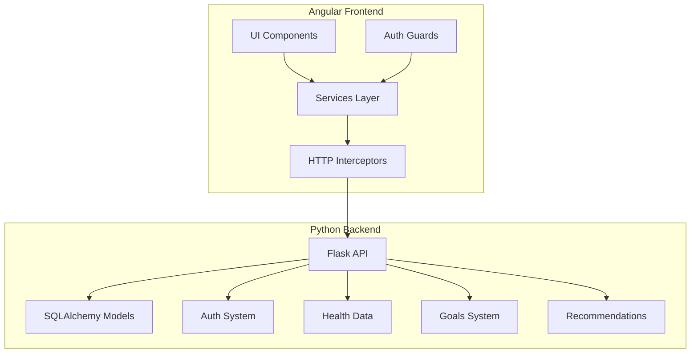

# System Patterns

## Architecture Overview



## Design Patterns

### Frontend Patterns

1. Component Architecture
   - Feature-based organization
   - Smart/Presentational component pattern
   - Shared component library
   - Lazy-loaded modules

2. State Management
   - Service-based state
   - Observable data streams
   - Reactive form patterns
   - Local storage caching

3. Authentication
   - JWT token management
   - Route guards
   - HTTP interceptors
   - Secure session handling

4. Data Flow
   - Service abstraction layer
   - TypeScript interfaces
   - Async/await patterns
   - Error handling strategies

### Backend Patterns

1. API Architecture
   - RESTful endpoints
   - Blueprint organization
   - Resource-based routing
   - Middleware pipelines

2. Data Models
   - SQLAlchemy ORM
   - Model relationships
   - Data validation
   - Schema migrations

3. Authentication System
   - JWT implementation
   - Role-based access
   - Session management
   - Security middleware

4. Business Logic
   - Service layer pattern
   - Repository pattern
   - Factory pattern
   - Strategy pattern

## Code Organization

### Frontend Structure
```
frontend/
├── src/
│   ├── app/
│   │   ├── components/    # Reusable UI components
│   │   ├── services/      # Data and state services
│   │   ├── guards/        # Route protection
│   │   ├── interceptors/  # HTTP request handling
│   │   ├── models/        # TypeScript interfaces
│   │   └── utils/         # Helper functions
│   ├── assets/           # Static resources
│   └── environments/     # Environment configs
```

### Backend Structure
```
backend/
├── routes/          # API endpoints
├── models/          # Database models
├── services/        # Business logic
├── utils/          # Helper functions
└── tests/          # Unit tests
```

## Technical Standards

1. Code Style
   - TypeScript strict mode
   - Python PEP 8
   - ESLint/Prettier
   - Type safety

2. Testing Strategy
   - Unit tests
   - Integration tests
   - E2E testing
   - Test coverage goals

3. Security Practices
   - HTTPS enforcement
   - JWT best practices
   - Input validation
   - CORS policies
   - XSS prevention
   - CSRF protection

4. Performance Patterns
   - Lazy loading
   - Caching strategies
   - Database indexing
   - Query optimization
   - Resource minification

## Integration Points

1. Frontend to Backend
   - REST API calls
   - JWT authentication
   - Error handling
   - Response caching

2. Database Integration
   - SQLAlchemy ORM
   - Migration management
   - Connection pooling
   - Transaction handling

3. External Services
   - Health data providers
   - Analytics services
   - Monitoring systems
   - Backup services

## Development Workflow

1. Version Control
   - Feature branching
   - PR reviews
   - Commit conventions
   - Branch protection

2. CI/CD Pipeline
   - Automated testing
   - Build verification
   - Deployment stages
   - Environment management

3. Documentation
   - API documentation
   - Code comments
   - Technical specs
   - Architecture diagrams
